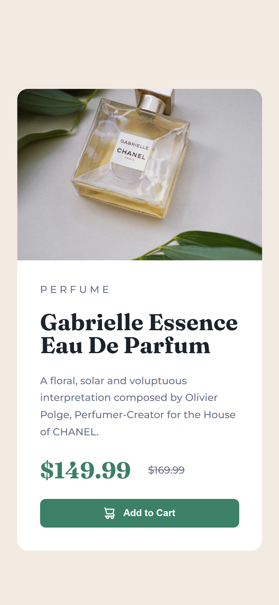

# Frontend Mentor - Product preview card component solution

This is a solution to the [Product preview card component challenge on Frontend Mentor](https://www.frontendmentor.io/challenges/product-preview-card-component-GO7UmttRfa). Frontend Mentor challenges help you improve your coding skills by building realistic projects.

## Table of contents

- [Overview](#overview)
  - [The challenge](#the-challenge)
  - [Screenshot](#screenshot)
  - [Links](#links)
- [My process](#my-process)
  - [Built with](#built-with)
  - [What I learned](#what-i-learned)
  - [Continued development](#continued-development)
  - [Useful resources](#useful-resources)
- [Author](#author)
- [Acknowledgments](#acknowledgments)

## Overview

### The challenge

Users should be able to:

- View the optimal layout depending on their device's screen size
- See hover and focus states for interactive elements

### Screenshot




### Links

- Live Site URL: [product-preview-card-component](https://mpluggie7.github.io/femt-product-preview-card-component/)

## My process

### Built with

- Semantic HTML5 markup
- CSS custom properties
- Flexbox
- Mobile-first workflow
- [Styled Components](./style.css) - For styles

### What I learned

I've learned to switch the image for desktop and mobile by using the display styles. When it doesn't show let it display=none and wants to show let display=block or any value.

```css
.imgDesktop {
  display: none;
}

.imgMobile {
  display: block;
  width: 100%;
  height: 100%;
  border-radius: 15px 15px 0 0;
}
```

### Continued development

### Useful resources

## Author

- Website - [megamaxo-app](https://www.megamaxo-app.com)
- Frontend Mentor - [@Mpluggie7](https://www.frontendmentor.io/profile/Mpluggie7)

## Acknowledgments
